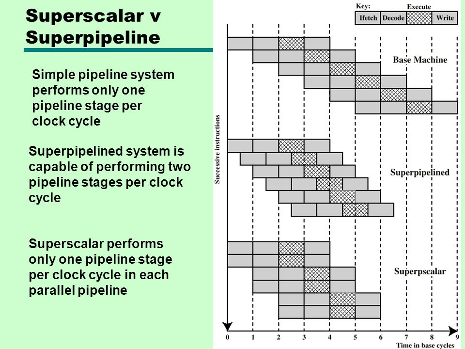

## Information Handled by Computer

- **Instruction:** Specify operation to be performed
- **Data:** Used as operands by the instructions

## Functional Units

 -  **Input Unit**
	   Takes the input and converts it into binary language that the computer understands
 - **Output Unit**
	  Converts the binary data coming from CPU to human understandable form
 - **Memory Unit**
	 Stores data and instructions
     - Primary memory
     - Secondary memory
 - **ALU Unit**
	  Performs mathematical calculations and takes logical decisions
 - **Control Unit**
	  **Controls** the data flow in and out of CPU, operations of ALU, memory registers and I/O units.	
	
	  **Carry out** all the instructions stored in the program.
	
	  **Decodes** the fetched instruction, interprets it and sends control signals to input/output devices.

## CPU Parts

   - ALU
   - Control Unit
   - Registers
	   - General purpose registers: used to store temporary data during any ongoing operation
	   
	   - Special purpose registers: holds the status of a program and designated for a special purpose
	   
		   - Instruction Register (IR): stores the instruction currently being executed
		   
		   - Program Counter (PC): contains the address of the next instruction to be executed
		   
		   - Memory Address Register (MAR): holds the address of the location to be accessed from memory
		   
		   - Memory Data Register (MDR): contains data to be written into or to be read out from the addressed location

## General Instruction Cycle
  - **Fetch instruction**: retrieve the instruction from memory
  
  - **Decode instruction**: identifying the opcode and any operands that are needed to execute the instruction
  
  - Fetch Operands from memory, *if needed*
  
  - **Execute instruction**: perform the operation specified by the instruction
  
  - Store Result in memory, *if needed*

## Typical Operating Steps
	1. Program reside in the memory through input devices
	2. PC is set to point to the first instruction
	3. The address in PC is moved to MAR
	4. Control unit send Read signal to memory
	5. The instruction is loaded into MDR
	6. The content of MDR is transferred to IR
	7. Increment PC by 1
	8. Decode and execute the instruction
	9. Get operands for ALU from registers or memory
	10. Perform operation in ALU
	11. Store the result back to register or memory

## Bus Structures
	Bus: A group of lines that serves as a connecting path for several devices, used to send control signals and data between the processor and other components
  - Address Bus
  - Data Bus
  - Control Bus
## Performance
  - Factors
	  - Hardware design
	  - Instruction set architecture
	  - Compiler design
  - Basic Performance Equation
	- T – Processor time required to execute a program in high-level language
	
	-  N – Number of actual machine language instructions needed to complete the execution
	
	- S – Average number of basic steps needed to execute one machine instruction.
	
	- R – Clock rate
	$$ T = {N * S \over R} $$

 - Pipeline and Superscalar Operation
	
	Pipelining: overlapping the execution of successive instructions
	
	Superscalar operation – multiple instruction pipelines are implemented in the processor.
	  
	
	